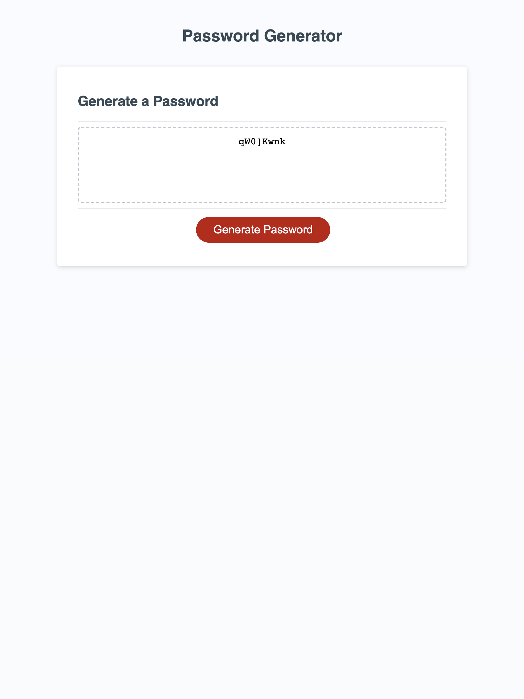

# Password Generator
This project implements a password generator in Javascript. It allows for the user to specify a password length of at least 8 characters and no more than 128 characters. It also allows for the user to specify if they would like to have 1 or more of these character types in the password: lowercase, uppercase, numeric and special characters from https://www.owasp.org/index.php/Password_special_characters. Once the user has chosen their password criteria, the generated password is shown on the web page.

## Site Picture


## Getting Started

To view and edit the files you can clone the repo from github using the following command:

```
git clone git@github.com:ts795/password-generator.git
```

### Prerequisites
No additional software besides a text editor and a web browser are needed to view and edit the files.


### Installing
No installation of software is required.


## Built With

* [HTML](https://developer.mozilla.org/en-US/docs/Web/HTML)
* [CSS](https://developer.mozilla.org/en-US/docs/Web/CSS)
* [Javascript](https://developer.mozilla.org/en-US/docs/Web/Javascript)

## Deployed Link

* [See Live Site](https://ts795.github.io/password-generator/)


## Authors

* Sam Lingampalli 

- [Link to Portfolio Site](https://ts795.github.io/)
- [Link to Github](https://github.com/ts795)
- [Link to LinkedIn](https://www.linkedin.com/in/sam-l-3b3838132/)


## License

This project is licensed under the MIT License 

## Acknowledgments

* getRandomInt function is from https://developer.mozilla.org/en-US/docs/Web/JavaScript/Reference/Global_Objects/Math/random